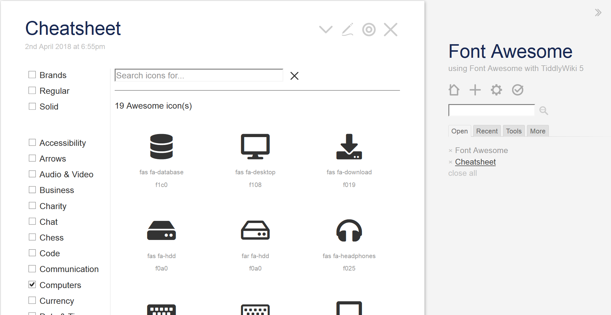

# Font Awesome&nbsp;Free&nbsp;5 for TiddlyWiki&nbsp;5

Simply download the
<i class="fas fa-download"></i>&nbsp;[TW5FontAwesome plugin](output/fontawesome.tid)
and then drag and drop it into your TiddlyWiki in order to enjoy
<i class="fas fa-external-link-alt"></i>&nbsp;[Font Awesome Free 5](https://http://fontawesome.com/).

There is no need to install the font(s) into your operating system in order to use it with TiddlyWiki&nbsp;5. Instead, simply drop this plugin into your TiddlyWiki and that's it.

Our <i class="fas fa-eye"></i>&nbsp;[plugin demo wiki](output/fontawesome.html) even features an interactive _offline_ icon cheatsheet...

# Live Demonstration

Take a <i class="fas fa-eye"></i>&nbsp;[live tour](output/fontawesome.html)
to see how the TW5FontAwesome plugin works. And learn more about
how to use it in your own TiddlyWikis.

